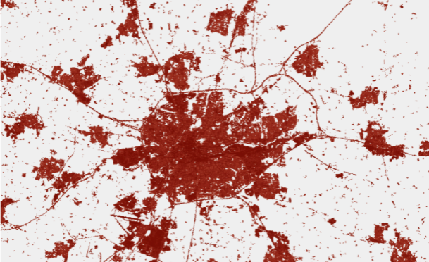

# Classification of Urban Areas on Synthetic-Aperture Radar Imagery
## Assignment for Interdisciplinary Project in Data Science (194.047)

This project work was created as an assignment for the course: Interdisciplinary Project in Data Science (194.047) 2021S @ TU Wien
[Link to TISS Lecture](https://tiss.tuwien.ac.at/course/educationDetails.xhtml?dswid=1672&dsrid=629&semester=2021W&courseNr=194047)

## Abstract
The main goal of this research project is to implement and evaluate an effective method to detect and classify urban areas, land covered by buildings, and other man-made structures on synthetic-aperture radar imagery. The best performing solution is a neural network-based model with U-net architecture, which is able to do binary image segmentation on the image tiles. As a result of the research, I deliver a model implementation that successfully identifies urban areas on the provided satellite images.

## Deployment

1. Clone the repository  
2. Create a conda environment and activate it (Optional)  
`conda create -y -n interdisc python==3.9.0`  
   `conda activate interdisc`  
3. Navigate to the repository  
`cd path/to/interdisc`  
4. Install dependencies  
`conda install -r requirements.txt`  
5. Run model.py to train a model  

## Data
The data, used for the work is provided by a high-resolution sensor system of the European Space Agency, backed by its Sentinel-1 satellite mission and it covers the region of Innsbruck. The data was provided by the university and it is not publicly available!

The data, used by the model is pre-processed by the `preprocess.ipynb` script and the masks for urban areas are created by the `create_masks.ipynb` script. The pre-processed data can be regenerated by simply running the scripts.

### Authors
[Peter Bognar](https://github.com/bognarpeter)  
